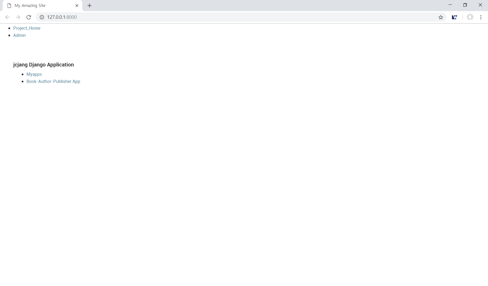

8시 반 부터

파이썬 웹 프로그래밍 복습 & 스터디 준비 5, 6, 7장 다시해보기

- 기존에 만들었던 myapps(tutorial에서는 polls) app의 view를 수정했다. 함수형 view에서 클래스형 view로 수정

- objects의 list, detail 등은 많이 사용하는 기능인데 클래스형 view를 사용하니 상당히 간단하게 구현할 수 있다.

- 데이터를 보내고 싶을 때는 get_context_data()를 오버라이딩하면 된다.

- 이제 6장에서 배포 환경 만들기를 하자.
