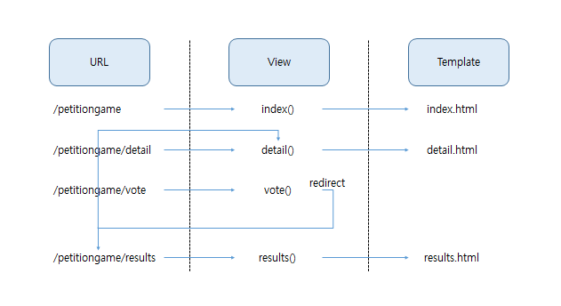
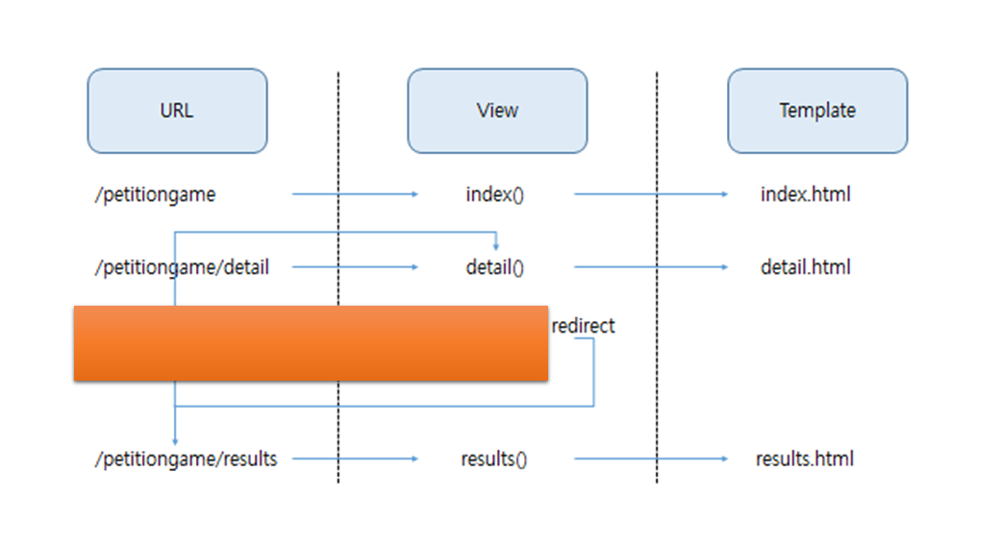

## 프로젝트 설명

프로젝트 명: 청원 게임

프로젝트 설명: 국민 청원 제목을 보고 어떤 청원의 참여인원이 맞추는 게임

프로젝트는 개요는 다음과 같이 수정되었습니다.

###프로젝트 수정 전

###프로젝트 수정 후

/petitiongame/detail에서 유저는 청원 제목을 보고 둘 중 하나를 선택합니다.

/petitiongame/detail에서 정답을 확인하고 정답일 경우 detail로 연결하고

오답일 경우 results로 연결합니다.

### 개선사항
클라이언트에게 넘겨 줄 문제, 최고 점수, 현재 점수를 전역 변수로 만들고 response를 했다.

문제는 이 서버로 많은 사람들이 접속하면 현재 점수, 최고 점수가 뒤죽박죽이 된다는 것이다.

서버는 A 사용자의 최고 점수를 전역 변수로 저장하기 때문에 B라는 새로운 사용자가 request가 오면
가지고 있던 최고 점수(A 사용자의 최고 점수)를 response로 담아서 주기 때문에 이렇게 구현하면 안된다.

결국 쿠키, 세션을 이용해서 하거나 사용자 이름을 입력받아서 간단한 로그인 겸 유저 테이블을 생성
할 예정이다.