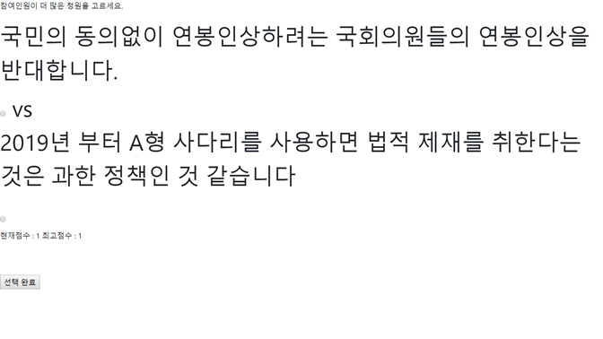

# 2019 1월 회고...

## 1.DJango 기초 스터디

12월부터 2달 동안 진행한 기초 스터디를 마쳤고 이제 실전으로 스터디를 진행할 예정이다.
이 스터디를 통해 Django Framework을 이용해 간단한 웹 애플리케이션 프로그래밍을 할 수 있게 되었고
서버 배포도 할 수 있게 되었다. 예시로 나오는 polls(투표)앱을 확장하여

위와 같은 청원 게임을 만들었다. [프로젝트 설명](20190126.md) 

설에 배운 부분 복습하자. 그리고 [Django 웹 서버 연동 원리](Web/django/Django의%20웹%20서버%20연동%20원리.md) 정리한
글에서 이 [링크](https://ko.wikipedia.org/wiki/웹_서버_게이트웨이_인터페이스) 읽고 내용 추가해서 글 쓰기

## 2.독서

스터디 진행할 때 읽은 책이다. 스터디 준비하느라 출퇴근하면서 지하철에서도 읽었던 기억이 나서
눈물 나려고 하지만 CBV를 처음 알고 나서 신박함에 경의로움을 표했던 기억이 난다.

2년 전 쯤에 샀던 것 같은데 이제서야 다 읽었다. 매 장이 다 주옥 같은 명언이었다. 견습생으로 서
가져야할 태도부터 그 이후의 단계까지 설명한다. 프로그래머의 일생을 짧게 풀어 쓴 책이라는 느낌이 들었다.
책에서는 '가장 뒤떨어진 이가 돼라', '무지를 드러내라' 자신의 상황을 인정하고 동료들에게 도움을
받고, 도움을 줄 수 있는 사람이 되라고 말한다. '멘토를 찾아라', '부숴도 괜찮은 장난감' 등의 내용은
이 책을 읽고 실천하고 있는 부분이다.

## 3.개인 프로젝트 실패

Django 스터디를 하면서 polls 앱을 확장한 프로젝트를 하려고 했는데 미흡한 부분이 많았다. 과연 이번 설에는
부트스트랩을 이용해 이쁘장한 Front-end를 만들 수 있을지가 관건이다!

## 4.알고리즘 문제풀이

2문제 밖에 못풀었지만 중요한건 기본기라는 것을 다시 한 번 느꼈다. 풀이 방법이 생각나지 않아서
손도 못대는건 아쉬움이 없었지만, 생각을 코드로 구현할 때 뭔가 계속 앞을 막고 있는 느낌이 들었다.
장애물을 치우는 방벙은 기본기를 갈고 닦는 것이라고 생각한다.

## 5. 그래서 2월은?

기본기를 확실히 쌓아봅시다.

- Django 실전편 스터디
- Python 기초 스터디
- 청원 게임 Front-end, Back-end 모두 구현
- 그림으로 배우는 HTTP&Network Basic 독서
- Hello Coding 알고리즘 독서