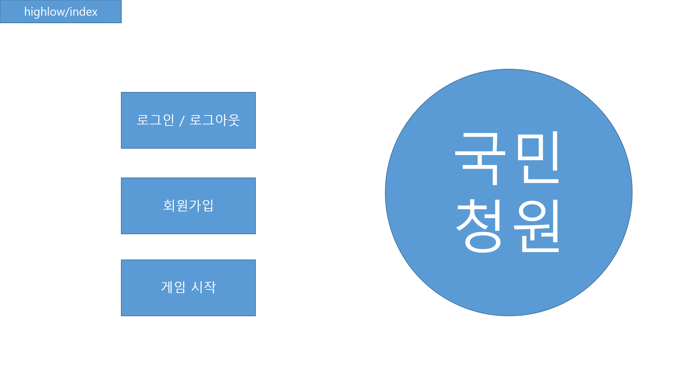
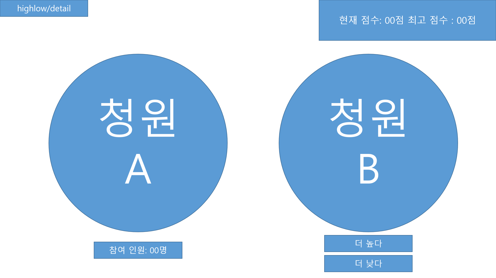
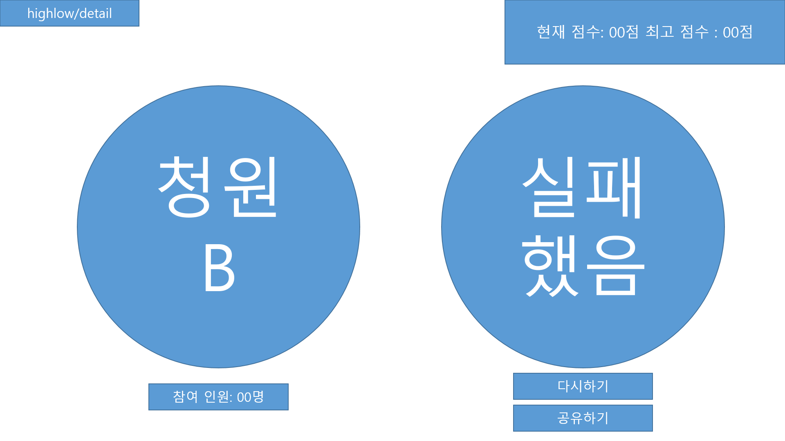

퇴근하고 10시 반 부터

또 한 번의 실패를 방지하기 위해 프로젝트 기획부터 다시한다.

index 페이지입니다.

사이트 로고를 추가할 것이고

로그인/로그아웃, 회원가입, 게임 시작 버튼이 있습니다.

버튼 클릭 시 해당 페이지로 이동하고 로그인 된 사용자만 게임 시작 버튼 클릭 시 highlow/detail로 이동합니다.

게임 시작 클릭 시 user의 selectedchoice에 청원 두개를 입력하고 currentscore를 초기화합니다.

detail 페이지입니다.

로그인 한 사용자의 필드에서
selectedchoice, currentscore, maxscore를 가져옵니다.

청원 A는 selectedchoice[-2]이고
청원 B는 selectedchoice[-1]입니다.

노출되는 데이터는
청원 A의 제목, 참여 인원
청원 B의 제목 입니다.

더 높다. 혹은 더 낮다. 버튼 클릭시 highlow/vote로 이동합니다.

highlow/detail에서 클릭한 버튼과 정답을 비교합니다.

ajax를 이용하여 청원 B의 참여 인원을 애니메이션으로 숫자를 노출합니다.

정답이면 청원 B가 왼쪽으로 이동하고selectedchoice 배열에 추가된 청원을 원래 청원 B의 자리에 넣습니다.

오답이면 청원 B가 왼쪽으로 이동하고 currentscore를 초기화 합니다. 원래 청원 B의 자리에 심심한 위로의 말을 적습니다.

ajax를 이용하여 정답이면 user의 selectedchoice 배열에 청원을 하나 추가하고 청원 B를 왼쪽으로 옮기고 참여 인원을 애니메이션을 주고 숫자를 노출합니다.
그리고 selectedchoice 배열에 추가된 데이터를 청원 B의 자리에 넣습니다.

다시하기를 클릭하면 index로 이동하거나 selectedchoice를 초기화하고 detail로 넘어갑니다. (추후 구현)