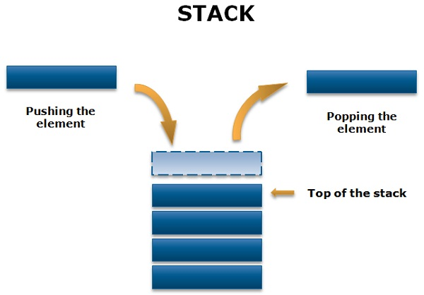

# 알고리즘 스터디 1주차 스택, 큐

# Intro

Oct 15, 2019 장지창

안녕하세요. 프로그라피 5기 Django팀 장지창입니다.

오늘은 알고리즘 스터디 1주차에 진행한 스택, 큐에 대해 알아보겠습니다. 저희는 매주 두개의 자료구조 주제를 선정하여 관련 문제를 풉니다. 그리고 오프라인에서 개념 강의를 제공하는 방식으로 스터디가 진행되고 있습니다.

지금부터 아래에서 언급하는 내용은 제가 알고리즘 스터디를 준비하면서 스택, 큐에 대해 알아본 내용입니다. 혹시나 틀린 부분이 있거나 다른 생각이 있으시다면 댓글이나 이메일을 통해 서로 의견을 공유할 수 있으면 좋을 것 같습니다.

---

# 개념 설명

먼저, 스택입니다. 스택은 LIFO(Last In First Out)순서를 따르는 선형 데이터 구조입니다. 

스택의 모든 삭제 및 삽입은 스택 상단에서 수행됩니다. 그래서 마지막으로 추가된 요소가 스택에서 가장 먼저 제거됩니다. 이것이 LIFO라고 불립니다.



스택에 어떤 연산이 있는지 알아볼까요?

스택에는 다음과 같은 연산이 있습니다.
- push: 스택에 새로운 요소를 추가합니다.
- pop: 스택에서 요소를 제거합니다.
- isEmpty: 스택이 비어있는지 확인합니다.
- peek: 스택의 맨 위 요소를 반환합니다.

그렇다면 스택을 어떻게 구현할까요? python tutorial 공식 문서의 [리스트를 스택으로 사용하기](https://docs.python.org/ko/3/tutorial/datastructures.html#using-lists-as-stacks)를 살펴보겠습니다.

스택에 새로운 요소를 추가할 경우 append()를 사용하고 스택에서 요소를 제거할 경우 명시적인 인덱스 없이 pop()을 사용하라고 하네요. 예시를 참고해서 Stack Class를 만들면 아래와 같습니다.

```python
class Stack():
    def __init__(self):
        self.stack = list()

    def push(self, e):
        self.stack.append(e)

    def pop(self):
        if self.stack:
            return self.stack.pop()

    def isEmpty(self):
        if self.stack:
            return False
        return True

    def peek(self):
        if self.stack:
            return self.stack[-1]


if __name__ == "__main__":
    s = Stack()
    s.push(1)
    s.push(2)
    s.push(3)
    s.push(4)
    print(s.pop())
    print(s.peek())
    print(s.isEmpty())
    print(s.pop())
    print(s.pop())
    print(s.pop())
    print(s.isEmpty())
```

---

# 관련 문제
- https://leetcode.com/problems/min-stack/
- https://leetcode.com/problems/valid-parentheses/

# 이슈 정리

~스터디 때 나온 이슈들 정리해서 추가 예정~

# 참고
- https://docs.python.org/ko/3/tutorial/datastructures.html#using-lists-as-stacks
- https://techdifferences.com/difference-between-stack-and-queue.html