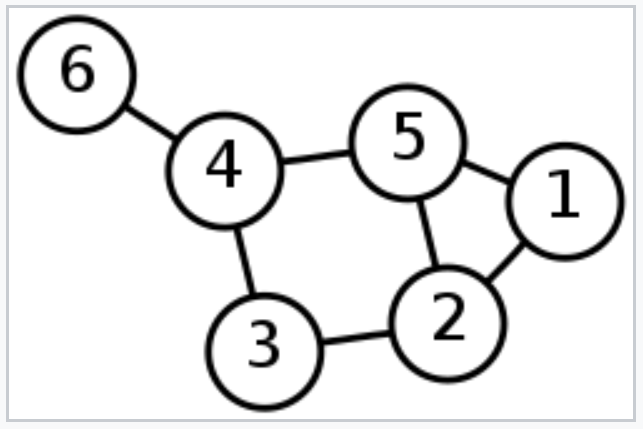

# 알고리즘 스터디 1주차 Tree, Hash

# Intro

Oct 22, 2019 장지창

안녕하세요. 프로그라피 5기 Django팀 장지창입니다.

오늘은 알고리즘 스터디 2주차에 진행한 트리에 대해 알아보겠습니다. 저희는 매주 두개의 자료구조 주제를 선정하여 관련 문제를 풉니다. 그리고 오프라인에서 개념 강의를 제공하는 방식으로 스터디가 진행되고 있습니다.

지금부터 아래에서 언급하는 내용은 제가 알고리즘 스터디를 준비하면서 스택, 큐에 대해 알아본 내용입니다. 혹시나 틀린 부분이 있거나 다른 생각이 있으시다면 댓글이나 이메일을 통해 서로 의견을 공유할 수 있으면 좋을 것 같습니다.

---

# 개념 설명

트리를 소개하겠습니다. 트리에 대해 알아보기 전에 먼저 그래프와 노드에 대해 먼저 알아보도록 하겠습니다. 왜냐하면 트리는 그래프의 한 종류이고 그래프는 노드와 노드를 잇는 간선으로 이루어져 있기 때문이죠. 지금은 이해가 되지 않더라도 이 글을 다 읽는다면 이해할 수 있을거에요.

`노드`에 대해 알아보겠습니다. 노드란 데이터 구조에서 기본 단위 중 하나입니다. 주로 연결리스트나 트리 구조를 구현하기 위해 사용됩니다. 노드에는 데이터가 포함되고 다른 노드에 연결될 수 있습니다.

그림의 동그라미들이 바로 노드입니다. 동그라미 안에 있는 숫자가 노드에 있는 데이터입니다. 노드는 다른 노드와 연결될 수 있다고 했는데, 연결하려면 간선이라는 것이 필요합니다. 그림에서는 동그라미와 동그라미를 잇는 선이 간선이 되겠네요.



`그래프`란 노드와 간선으로 구성된 비선형 데이터 구조를 말합니다. 노드(node)는 정점(vertics)라고도 불리고 간선은 그래프의 두 노드를 잇는 선(lines) 또는 호(arcs)를 말합니다. 보다 공식적으로는 다음과 같이 말할 수 있네요.

> 그래프는 유한 노드와 한 쌍의 노드를 연결하는 간선 세트로 구성되어있다.


이제 드디어 트리에 대해 알아보겠습니다. `트리`란 그래프의 일종으로, 여러 노드가 한 노드를 가리킬 수 없는 구조입니다. 간단하게는 회로가 없고, 서로 다른 두 노드를 잇는 길이 하나뿐인 그래프를 트리라고 합니다.

트리에는 여러 종류가 있는데, 그 중 `binary tree`를 구현해보겠습니다. `binary tree`는 모든 노드가 최대 두 개의 자식 노드를 갖는 트리를 말합니다. 보통 왼쪽에서 오른쪽으로 노드를 채워나갑니다.

```python


```

---

# 관련 문제
- https://leetcode.com/problems/merge-two-binary-trees/
- https://leetcode.com/problems/maximum-depth-of-binary-tree/

# 참고
- https://en.wikipedia.org/wiki/Node_(computer_science)
- https://www.geeksforgeeks.org/graph-data-structure-and-algorithms/
- http://www.laurentluce.com/posts/binary-search-tree-library-in-python/
- https://www.tutorialspoint.com/python_data_structure/python_binary_tree.htm