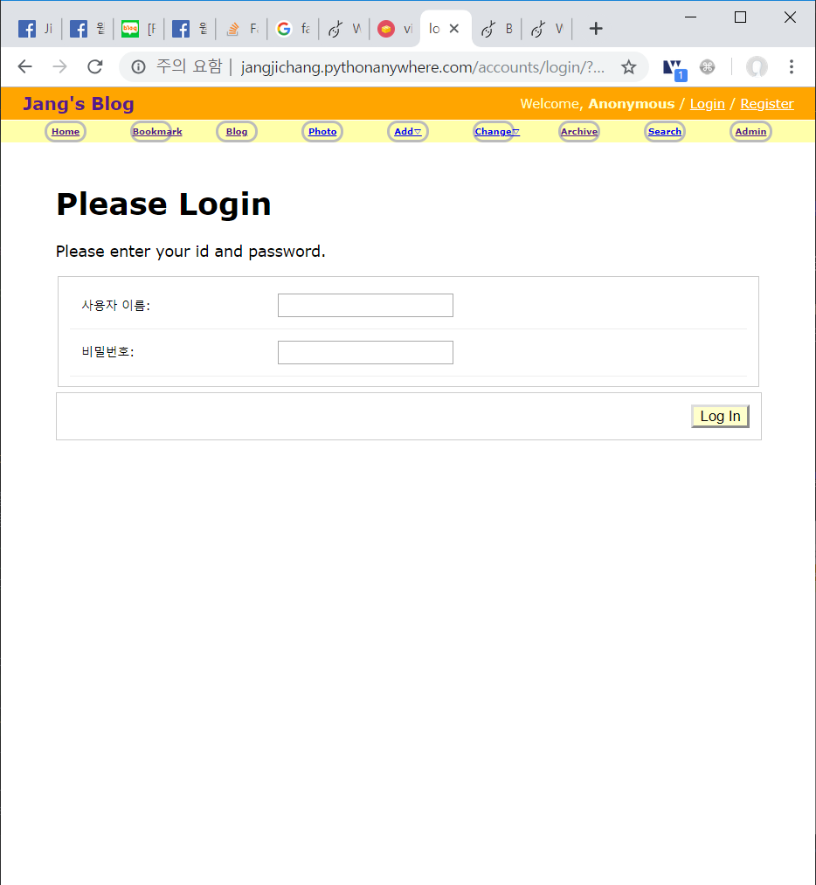
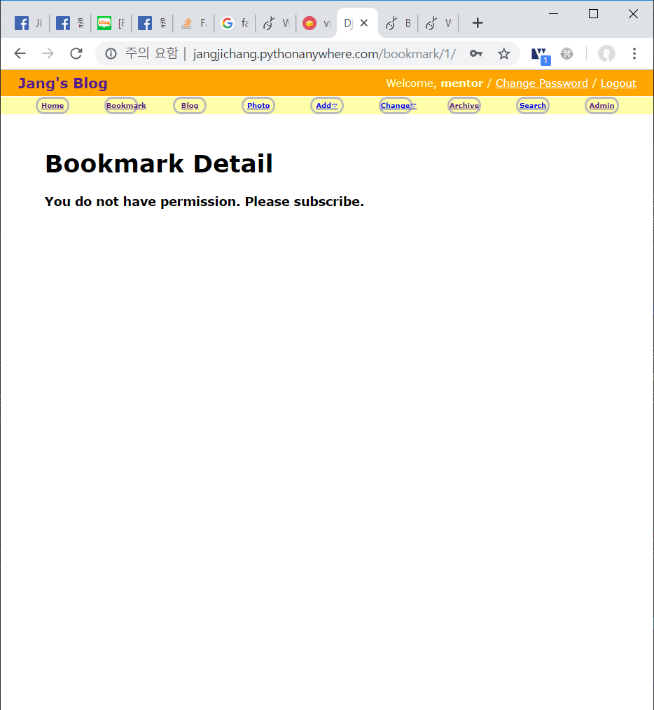
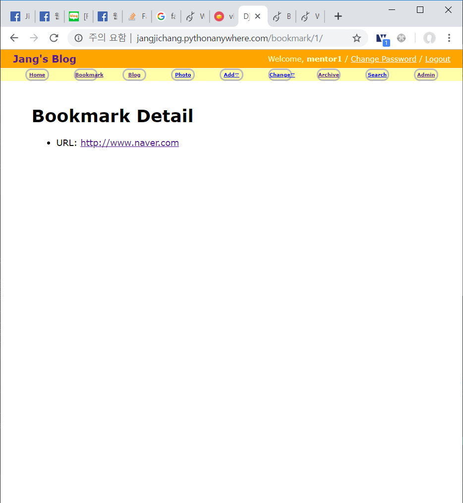

 # 이번주 과제
 - 회원 관리 시스템 입니다.
어떤 형태든 상관 없지만
인증 수단은 갖추고 있어야 합니다.

여러분이 좋아하는 언어와 기술을 이용해서 먼저 해결해 보세요. 하나를 계속 다듬어서 완벽하게 하셔도 좋고, 다양한 언어나 기술을 활용해서 문제를 탐구하셔도 좋습니다. 즉, 자주 결과를 공유해 주시는 게 좋습니다.
다음의 과정을 따라서 진행해 주세요:

# 진행 사항
1. 이 프로그램을 사용하는 상황과 필수 요소, 제약 조건 등을 정합니다.
- 사용하는 상황
    - 내 블로그를 방문하는 여러 사용자 중에서 '특별한' 사용자만 Bookmark 게시물을 볼 수 있도록한다.
- 필수 요소
    - [개인 블로그](http://jangjichang.pythonanywhere.com/?utm_source=github&utm_medium=banner&utm_campaign=post)
    에서 '특별한' 사용자만 Bookmark앱에 접근할 수 있도록한다.
- 제약 조건
    - 권한이 있는 사용자만 접근 가능하도록한다.
    - '특별한' 사용자는 Django User model에서 is_staff가 True인 사용자를 말한다.


2. 이 프로그램에 무엇을 입력했을 때 어떤 결과가 나와야 하는지 유형을 분류하고 구체적인 사례를 찾아 봅니다.
- 로그인 하지 않은 유저라면 로그인 페이지로 이동한다.
- is_staff 값이 True이면 Bookmark detail에 접근 시 해당 글을 보여주고
- 아니라면 볼 수 없다는 페이지를 보여준다.

3. 어디까지 구현할 건지, 무엇이 가장 중요한지, 어떤 순서대로 진행해야 할지 결정합니다.
- 구현하고 싶은 것은 회원가입을 할 때 "쿠폰 번호 등록"을 입력 받아 시스템에서 설정한 쿠폰 번호면 is_staff를 True로 하고
그 외의 경우는 False로 하는 것임
- 가장 중요한 것은 회원을 관리하는 것인데, 회원가입을 할 때 staff 값을 부여할 수도 있고 admin 사이트에서 superuser가 관리 할 수도 있음
- 구현하는 순서 정의
    - 회원가입 시 is_staff 값을 설정
        - "쿠폰 번호 등록"이라는 label을 추가하여 특정 코드가 입력되면 staff 기능 추가.
    - is_staff 값에 따라 보여줄 페이지를 구분함
    - is_staff 값을 확인하고 페이지를 보여줌

4. 프로그램을 구현합니다.
- 회원가입 URL 설정 (urls.py)
```python
from .views import UserCreateView, UserCreateDoneTV

urlpatterns = [
        ...
    path('accounts/register/', UserCreateView.as_view(), name='register'),
    path('accounts/register/done/', UserCreateDoneTV.as_view(), name='register_done'),
        ...
]
```

- 회원가입 view 설정 (views.py)
```python
from django.views.generic.base import TemplateView
from django.views.generic.edit import CreateView
from django.urls import reverse_lazy
from .forms import CreateUserForm

# User Creation
class UserCreateView(CreateView):
    template_name = 'registration/register.html'
    form_class = CreateUserForm
    success_url = reverse_lazy('register_done')


class UserCreateDoneTV(TemplateView):
    template_name = 'registration/register_done.html'
```

- 회원가입 form 설정 (forms.py)
```python
from django.contrib.auth.models import User
from django.contrib.auth.forms import UserCreationForm
from django import forms


class CreateUserForm(UserCreationForm):
    is_premium = forms.CharField(label="쿠폰 번호 등록")

    class Meta:
        model = User
        fields = ("username", "password1", "password2", "is_premium")

    def save(self, commit=True):
        user = super(CreateUserForm, self).save(commit=False)
        if commit:
            if self.cleaned_data["is_premium"] == 'impremium':
                user.is_staff = True
            user.save()
        return user
```

- Bookmark detail view 설정(bookmark/views.py)
- login required 설정함
```python
from django.contrib.auth.mixins import LoginRequiredMixin
from django.views.generic import ListView, DetailView
from .models import Bookmark


# Create your views here.
class BookmarkLV(ListView):
    model = Bookmark


class BookmarkDV(LoginRequiredMixin, DetailView):
    login_url = '/accounts/login'
    model = Bookmark
```

- Bookmark detail.html
- user.is_staff에 따라 보여지는 값 다르게 설정
```html


Django Bookmark Detail



<div id="content">
    <h1>Bookmark Detail</h1>
    <ul>
        <li>URL: <a href="{{ object.url }}"> {{ object.url }} </a></li>
    </ul>
    <!--<div id = "test">-->
    <!--Hi-->
    <!--</div>-->
</div>

<div id="content">
    <h1>Bookmark Detail</h1>
    <h4>구독하시면 볼 수 있습니다!</h4>
</div>


```
5. 프로그램을 공유합니다.
- 링크를 클릭하여
[bookmark list](http://jangjichang.pythonanywhere.com/bookmark/?utm_source=github&utm_medium=banner&utm_campaign=post)
페이지에 접속합니다.
- 로그인하지 않았으므로 로그인 페이지로 이동합니다.
- 오른쪽 위 register로 이동하여 계정을 만들거나 테스트용 계정으로 로그인합니다.
    - 사용자 이름:mentor // 비밀번호: studysoft1     // 이 계정은 게시물을 볼 수 있는 권한은 없습니다.
    - 사용자 이름:mentor1 // 비밀번호: studyhard1    // 이 계정은 게시물을 볼 수 있는 권한이 있습니다.
- 회원가입 페이지에서 "쿠폰 번호 등록"에 ispremium을 입력하고 회원가입을 하면 게시물을 볼 수 있습니다.

- 로그인하지 않은 사용자는 다음과 같은 화면이 나옵니다.

- 로그인 했지만 권한이 없는 사용자는 다음과 같은 화면이 나옵니다.
 
- 로그인 했고 권한이 있는 사용자는 다음과 같은 화면이 나옵니다. 


# 개선 사항
6. 결과를 확인하고 추가로 배운 점을 적용해 1로 돌아가서 다듬습니다.


    
