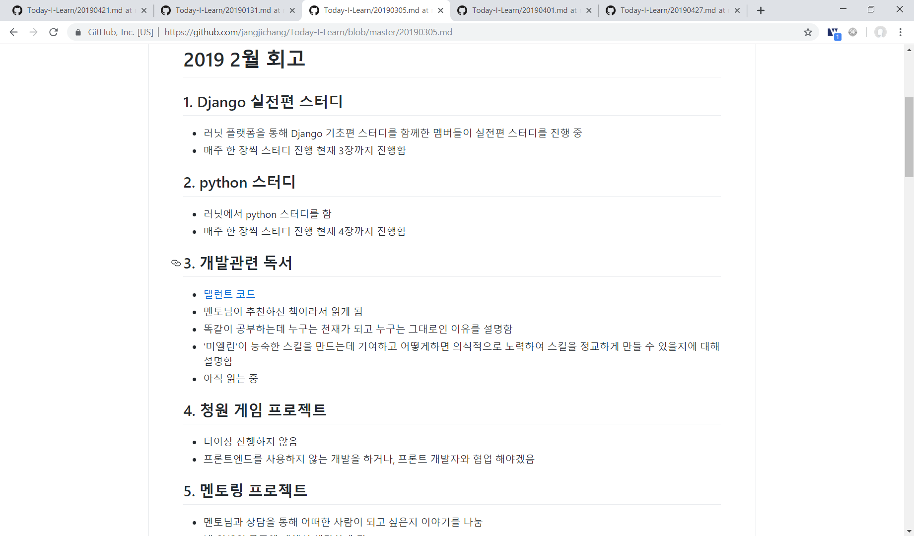

# 4월 모임
- 20190427 오후 4시 마이캠퍼스 7층
- 미리 공지를 했어야 했는데 제가 깜빡한 게 있네요. 참석하시는 분들은 5분 정도 길이의 발표를 준비해 주세요.
- 슬라이드 같은 보조 수단은 있어도 되고 없어도 됩니다. 발표 주제는 “지금까지 한 것 + 그 과정을 통해 배운 것 + 앞으로 할 것” 입니다.
- 구체적인 사례 하나만 이야기해도 되고, 개발과 관련이 없어도 됩니다. 가시적인 결과가 없었어도 됩니다. 저희가 좋아하는 건 스토리니까요.
- 좀더 긴 내용의 발표를 하고 싶다면 선착순 2명까지만 받습니다.
- 발표 연습이 필요하거나, 내가 배운 내용을 5분이라는 작은 그릇에 담을 수 없다고 느끼는 분은 지원하세요!
- 스터디 등에서 발표하려고 준비한 걸 미리 검증 또는 재탕하셔도 됩니다.

# 발표 준비
- 발표 준비
- 

## 1. 이 발표 상황과 필수 요소, 제약 조건 등을 정합니다. “내가 이 발표를 듣는다면?”이라고 가정하면 더 쉬울 수 있습니다.
- 상황: 멘토링 멤버들 첫 오프라인 모임에서 5분 정도 길이의 발표 진행
- 필수 요소: 발표 주제는 "지금까지 한 것 + 그 과정을 통해 배운 것 + 앞으로 할 것"
- 제약 조건: 반드시 스토리가 있어야함, 어느 발표에서나 마찬가지로 문제가 되는 발언은 삼가함
- 성별, 성적 지향, 장애, 외모, 신체 사이즈, 인종, 종교 관련 어떠한 차별적인 내용을 담지 않아야함
- 누구라도 발표를 즐길 수 있도록 텍스트 자료도 제공하고, 큰 목소리로 다 들리게 발표하기!

## 2. 이 발표에 어떤 내용을 담아야 하는지 유형을 분류하고 구체적인 사례를 찾아 봅니다.
- 지금까지 한 것
    - 내 회고록을 참고하여 지금까지 내가 무엇을 했는지 파악한다.
    - 
    - 
    - 
    - 
    - '파이썬 웹 프로그래밍 기초편' 스터디
    - '파이썬 웹 프로그래밍 실전편' 스터디
    - 'jump to python' 스터디
    - '프로그래머의 길, 멘토에게 묻다' 읽음
    - '탤런트 코드' 읽음
    - 멘토링 프로젝트 과제
    - 'Django Rest Framework을 이용한 REST API 개발 강좌' udemy 강의 30% 정도 수강하다 포기
    - 2주에 1회 'wcoding python hackday'에서 자습 & simon과 Django에 대해 궁금한거 물어보기
    - 4월 우아한 테크 세미나 참여
    - 반려견 관련 사이드 프로젝트 진행 중
    
- 그 과정을 통해 배운 것:
    - 무언가를 배운다는건 반드시 시간이 필요함
    - 그러니 조급해 하지말고 포기하지 않고 꾸준히 하는게 중요
    - 올해 들어서 책을 4권 읽었는데 정말 대단하고 역대급 독서임, 책을 읽다보니 내가 모르는게 너무 많다는걸 알게됨
    - 멘토링 프로젝트를 하면서 피드백을 받는다는게 얼마나 중요한 건지 알게 됨
    - 과제를 통해 아는 것 과 해본 것과는 정말 다르다고 느낌. 어디가서 안다고 말하면 안될 것 같다.
    - 너무 어려운 것(무턱대고 하고 싶은 것)을 하기보다는 내가 아는 것(컴포트 존)보다 살짝 높은 목표를 추구하는게 중요함
    - 안 그러면 쉽게 포기하게 됨
    - 물론 포기해도 얻는건 있지만 무기력함을 느껴서 싫음
    - 파이썬 웹 프레임워크인 'Django'를 조금 사용할 줄 알게 됨
    
- 앞으로 할 것:
    - 5월 부터 '배프의 오지랖 파이썬 웹프로그래밍' 스터디를 진행함
    - '1만 시간의 재발견' 읽기
    - 이 스터디만 하고 앞으로 스터디는 하지 않고 프로젝트만 할 예정
    - 꾸준히 TDD하기(천리길도 한 걸음 부터)
    - 5월 2019 Summer Coding - 여름방학 스타트업 인턴 프로그램 지원하기
    - Django Back-end 기술을 사용하는 회사로 이직 준비하기
    - 공부 시간 확보 하기(출퇴근길 활용하기, 친구와의 만남 줄이기, 여자친구와 2주에 1번 만나기)
        

## 3. 어디까지 구현할 건지, 무엇이 가장 중요한지, 어떤 순서대로 진행해야 할지 결정합니다.
- 5분 안에 발표하려면 시간이 없으니 스토리 하나를 정해서 발표해야함
- 가장 중요한건 스토리니까 Django 학습 경험을 주제로 발표하자!
- Django를 공부하면서 "지금까지 한 것 + 그 과정을 통해 배운 것 + 앞으로 할 것"은 설명하자.

## 4. 발표 자료를 준비합니다.
- 이름: 장지창
- 발표 주제: 나의 Django 학습 여정
- 시작하기 전에: 컴공 졸업, 2017년 12월~ 2018년 6월 인턴, 2018년 9월 ~ 현재 근무 중
- 2017년 12월, 졸업 시기 쯤 영상 처리 회사에 인턴으로 근무
- 사원 5명(대표님, 대표님 아내, 외국인 박사, 인턴 2명)
- python을 처음하게 됨
- 원래는 웹 프로그래밍을 하고 싶었고, 그러던 중 2018년 6월 인턴 친구가 퇴사
- 나도 퇴사하고 웹 프로그래밍 공부를 함
- 혼자 Django 공부를 하다가 돈을 벌어야 해서 일단 취업함
- 현 직장은 Google Analytics 솔루션 개발 일을 함
- 직장 다니고 3개월 후 "아 이건 아니다."
- 시도 때도 없는 야근(이거 언제언제까지 해주세요. 하고 일을 던짐) + 커리어에 대한 불확실성 + 자사 서비스를 개발하고 싶은 욕구 + 좋은 동료들과 일하고 싶은 욕구 + 등등
- 그 순간부터 이직 준비를 시작함
- 그러던 중 [러닛](https://www.learnit.co.kr/)에서 파이썬 웹 프로그래밍 스터디를 찾고 스터디를 진행함
- 스터디원 참여율이 좋아서 마지막에 공짜로 피자
- 
- 우여곡절 끝에 처음으로 책 한권을 다 보고 스터디 종료
- 5명으로 시작해서 3명으로 끝나는 기적
- 
- 기초편만 하니 뭔가 아쉬움 조심스럽게 말을 건냄
- "저희 이거 실전편도 있던데 스터디 해보실래요??"
- "실전편 스터디 시작"
- 
- 블로그를 만듦 (로그인, 북마크, 게시판, 포토앱 들이 있습니다.)
- 
- 
- 스터디를 통해 공부하고 이제서야 뭔가를 만들어 볼 수 있게 됨
- 이러한 과정을 통해 배운 것
- 컴퓨터공학 전공했고 졸업하면 되겠지라는 생각으로 아무것도 안함
- 프로그래밍을 유튜브로 배웠습니다.
- "이거 만들어봐야겠다."하고 뭣도 모르고 도전했다가 실패만 함
- 아니 그렇게 프로그래밍 시작하라면서요.
- 나에게 남은건 무기력함 뿐...
- 그것도 기초 실력이 있어야 가능하다는 것을 느끼고 스터디를 시작했던 것임
- 되는 것을 따라하고 거기에서 조금씩 수정하면서 원하는걸 만들어간다.
- 똑같은걸 계속 반복함
- 하다보니 어느새 To Do List를 만들고 있음
- 
- 너무 조급하게 생각하지말고 되는걸 따라하고 성장하자.
- 컴포트존에서 벗어나자. 내 실력보다 조금 높은걸 하자.
- 반드시 피드백을 받자.
- 시간이 너무 부족함 매일 6시에 일어나서 8시반 까지 출근하고
- 9시반 까지 공부하고 업무 시작함 ~~업무 틈틈히 Django 공부하고(옆 동료가 자꾸 처다봐요 ㅠㅠ)~~ 퇴근하고 12시나 1시까지 공부함
- ~~나도 여자친구랑 놀고 싶고 게임하고 싶고 친구랑 노래방 가고 싶어요~~
- 앞으로 할 일
- 
- 이걸로 마지막 스터디를 하고 앞으로는 프로젝트를 하면서 필요한 부분을 공부할 예정
- TDD 한걸음씩 시작하기
- 완벽한 서비스를 만들기

## 5. 발표를 합니다.
- 실제로 발표를 한다.

## 6. 결과를 확인하고 추가로 배운 점을 적용해 1로 돌아가서 다듬습니다.
- 발표자료 markdown vs ppt
    - ppt가 더 좋음
    - 발표할 장표만 보여줄 수 있어서 집중하기 좋다.
    - 화면 제어하기가 쉽다.
    - markdown의 장점
    - 글을 많이 쓸 수 있다.
    - github에 올리면 어느 OS든지 볼 수 있다.
- 발표 준비가 부족해서 내용이 Too Much하고 중복이 있었음
- 사람들의 눈을 마주치며 했어야하는데... 발표 자료 읽기 바쁨
- 질문 및 피드백
    - 청중들의 배경지식을 고려하기, 내가 아니까 남도 알거라고 생각했다.
    - 컴포트 존이란 무엇인가?
    - 
    - comfort zone
        - 어떠한 사물이 사람에게 친근한 느낌을 주는 심리적인 상태
        - 사람들은 낮은 수준의 걱정과 스트레스를 느끼며 환경을 통제할 수 있다.
        - 이 영역에서는 꾸준한 수준의 수행이 가능함
    - optimal performance zone
        - 안전 지대를 벗어나면 불안감이 생기고 스트레스 반응이 일어난다.
        - 이는 집중과 집중력 향상의 결과를 낳는다.
        - white(2009)는 어느 정도의 스트레스가 일의 성능을 향상시켜주는 '최적의 성능 구역'을 언급함
        - Yerkes(1907)는 "불안은 각성의 최적 수준에 도달할 때까지 일의 성능을 향상시킨다. 그 수준을 넘어서면 불안감이 높아지면서 일의
        성능이 악화 된다"고 언급함
    - 관련 링크 [comfort zone or danger zone](https://www.influencive.com/comfort-zone-danger-zone/), [your comfort zone 
    is danger zone](https://jayblock.com/your-comfort-zone-is-the-danger-zone/)
    - 1만 시간의 재발견 책에 관한 설명 / 탤런트 코드에도 나왔는데 심층연습 부분에서 언급됨
        - 의식적인 연습이 필요하다!
    - 여자친구 만나면서 프로그래밍에 도움되는건 없을까요?
        - ~~여자친구를 위한 이벤트 홈페이지?!~~
    - 스터디 진행 어떻게 하세요? 분량 정하는 방법 알려주세요.
        - 데드라인이 있는지 파악하고 있으면 그거에 맞춰서 함
        - 없으면 스터디원들이 할애할 수 있는 시간을 파악하고 이에 맞춘다.
        - 스터디 진행 시간(주 1회 2시간 혹은 2주에 1회 3시간 등)을 반영하여 분량을 정하고 진행하면서 피드백
        - 보통 한 책으로 2달 정도함
        - 빠르게 끝내려다 포기하기 보다는 꾸준히 하면서 마무리하는게 중요