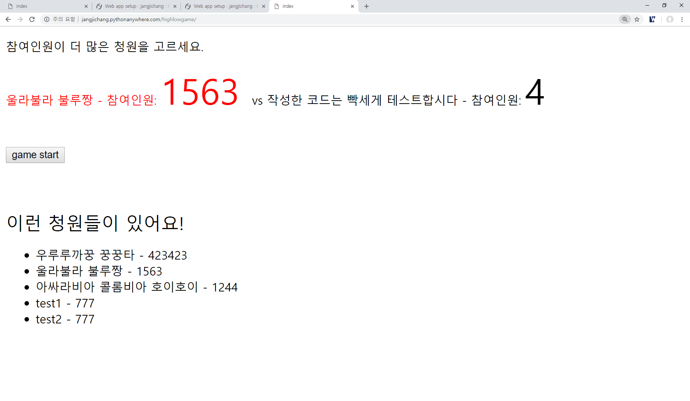

앱 첫 배포 성공!



앱 배포를 위한 설정

settings.py에서 설정함.

### 1. SECRET_KEY 감추기
```
import os
SECRET_KEY = os.environ['SECERT_KEY']
# 또는
with open(os.path.join(BASE_DIR, 'www_dir', 'secret_key.txt')) as f:
    SECRET_KEY = f.read().strip()
```

### 2. 디버그 모드 끄기
```
DEBUG=False
```

### 3. ALLOWED_HOSTS 설정
```buildoutcfg
ALLOWED_HOSTS = ['도메인주소']
```
DEBUG = False로 설정되어 있으면, 반드시 위 항목을 설정해야한다.
HTTP Host 헤더를 변조하여 CSRF 공격을 할 수 있기 때문에 이를 방지하는 것.


### 4. STATIC_ROOT 설정

```
STATIC_ROOT = os.path.join(BASE_DIR, 'www_dir', 'static')
```
개발 서버에서는 정적 파일들을 알아서 찾아주었지만, 운영 모드에서는 아파치와 같은 웹 서버에게
정적 파일들이 어디에 있는지 알려줘야한다.

www_dir 폴더에 정적 파일을 저장하겠다고 위와 같이 settings.py에 설정하고 다음 명령어를
실행한다.

>> python manage.py collectstatic

개발 모드에서는 runserver를 실행시킨 사용자의 권한으로 데이터베이스 파일이나
로그 파일을 액세스합니다. 그러나 운영 모드에서는 웹 서버 프로세스의 소유자
(예:apache) 권한으로 해당 파일들을 액세스 할 수 있어야합니다.

이를 위해 settings 모듈의 DATABASES 항목에서 NAME 속성값의 경로를
 db/db.sqlite3로 설정한다.
```buildoutcfg
DATABASES = {
        ...
        'NAME': os.path.join(BASE_DIR, 'db', 'db.sqlite3'),
        }
```

이제 웹 서버 프로세스가 db 폴더와 파일들을 읽을 수 있도록 설정한다.

서버가 리눅스 환경이라고 가정하고 다음의 명령어를 입력한다.

DJANGO Project의 최상위로 이동하여
>> mkdir db
>> mv db.sqlite3 db/
>> chmod 777 db/
>> chmod 666 db/db.sqlite3

이러한 설정을 하고 pythonanywhere을 이용해서 배포하면

[첫 배포](http://jangjichang.pythonanywhere.com/highlowgame/)처럼 앱을
배포 할 수 있습니다.