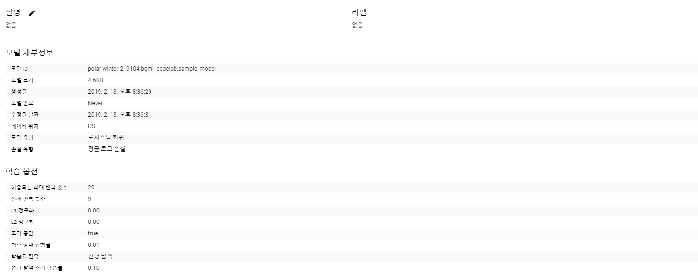
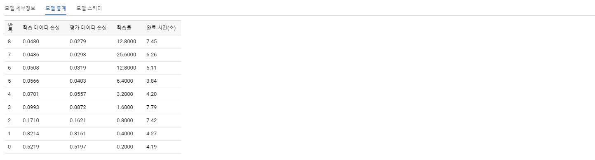
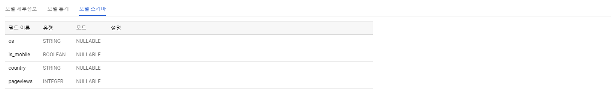
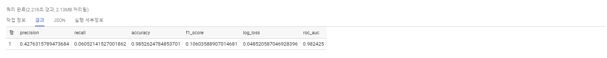

# BigQuery ML 시작하기

# 1. 개요

- BigQuery ML을 사용하면 SQL 쿼리를 사용하여 BigQuery에서 기계 학습 모델을 만들고 실행할 수 있습니다.
목표는 SQL 실무자가 기존 도구를 사용하여 모델을 작성하고 데이터 이동의 필요성을 제거하여 개발 속도를
높일 수 있게함으로써 기계 학습을 민주화(?)하는 것입니다.

- 만드는 것:
[sample Analaytics 360 dataset](https://support.google.com/analytics/answer/3437719)을
사용하여 방문자가 거래를 할 것인지 여부를 예측하는 모델을 만들 수 있습니다.

- 배우는 것:
BigQuery에서 기계 학습 모델을 작성, 평가 및 사용하는 방법

# 2. 설치 및 요구사항
- 이 단계는 생략함 [링크](https://codelabs.developers.google.com/codelabs/bqml-intro/index.html#1)
- 다만, 계정을 만들면 사용할 수 있는 데이터 셋이 없지만, BigQuery에서 사용할 수 있는 수많은 공개 데이터 셋이 있다.

# 3. 데이터 셋 만들기
- 뒤에 나올 sql 예제에서 테이블명을 입력하므로 Dataset ID는 bqml_codelab으로 정하는 것을 권장함.
- 이 단계는 생략함 [링크](https://codelabs.developers.google.com/codelabs/bqml-intro/index.html#2)

# 4. 모델 만들기
- **Analytics 360의 로지스틱 회귀 분석**
- 방문자가 거래를 할 것인지를 예측하는 모델을 만드는 방법은 다음과 같습니다.
```buildoutcfg
#standardSQL
CREATE OR REPLACE MODEL `bqml_codelab.sample_model`
OPTIONS(model_type='logistic_reg') AS
SELECT
    IF(totals.transactions IS NULL, 0, 1) AS label,
    IFNULL(device.operatingSystem, "") AS os,
    device.isMobile AS is_mobile,
    IFNULL(geoNetwork.country, "") AS country,
    IFNULL(totals.pageviews, 0) AS pageviews
FROM
    `bigquery-public-data.google_analytics_sample.ga_sessions_*`
WHERE
    _TABLE_SUFFIX BETWEEN '20160801' AND '20170631'
LIMIT 100000;
```
- SQL문 각 절에 대해 알아보겠습니다.
```CREATE OR REPLACE MODEL 'bqml_codelab.sample_model'```
 
- "bqml_codelab"은 데이터 집합의 이름이고 "sample_model"은 모델의 이름입니다.

```OPTIONS(model_type='logistic_reg') AS```
- model_type OPTIONS은 필수입니다.
- 지정된 모델 유형은 binary logistic regression입니다.
- 모델 유형은 linear_reg, logistic_reg 이렇게 두가지를 제공합니다. 자세한 옵션 설정은
[링크](https://cloud.google.com/bigquery/docs/reference/standard-sql/bigqueryml-syntax-create#model_name)
에서 확인 가능합니다.


- 조건식 구문
- IF(cond, true_result, else_result)
- IFNULL(expr, null_result)

- 방문자의 기기 운영체제, 모바일 기기인지의 여부, 방문자 국가 및 페이지 뷰 수를 거래가 이루어 졌는지 여부에 대한 기준으로 사용합니다.
- FROM 절에 20160801부터 20170631 까지의 테이블의 이름을 모두 지정해야 하는 경우 다음과 같아질겁니다.

```buildoutcfg
FROM (
    SELECT
        *
    FROM
        `bigquery-public-data.google_analytics_sample.ga_sessions_20160801` UNION ALL
    SELECT
        *
    FROM
        `bigquery-public-data.google_analytics_sample.ga_sessions_20160802` UNION ALL
    SELECT
        *
    FROM
        `bigquery-public-data.google_analytics_sample.ga_sessions_20160803` UNION ALL
    SELECT
        *
    FROM
        `bigquery-public-data.google_analytics_sample.ga_sessions_20160804` UNION ALL
        
        ...
```

- 하지만 와일드 카드 테이블을 사용하면 훨씬 간결해집니다.
```buildoutcfg
FROM
    `bigquery-public-data.google_analytics_sample.ga_sessions_*`
WHERE
    _TABLE_SUFFIX BETWEEN '20160801' AND '20170631'
```

```WHERE _TABLE_SUFFIX BETWEEN '20160801' AND '20170631'```

- 와일드 카드 테이블을 사용해야 하는 경우는 다음과 같습니다. 자세한 와일드 카드 설정은
[링크](https://cloud.google.com/bigquery/docs/querying-wildcard-tables?hl=ko)
에서 확인 가능합니다.


- 마지막으로 시간을 줄이기 위해 100000개의 데이터로 제한합니다.
```
LIMIT 100000;
```


- 이러한 쿼리를 실행하면 모델이 만들어집니다. 모델 세부정보, 모델 통계, 모델 스키마로 모델에 대한 정보를 확인할 수 있습니다.

- **모델 세부 정보**


- **모델 통계**


- **모델 스키마**


# 5. 모델 평가하기

```buildoutcfg
#standardSQL
SELECT
  *
FROM
  ml.EVALUATE(MODEL `bqml_codelab.sample_model`, (
SELECT
  IF(totals.transactions IS NULL, 0, 1) AS label,
  IFNULL(device.operatingSystem, "") AS os,
  device.isMobile AS is_mobile,
  IFNULL(geoNetwork.country, "") AS country,
  IFNULL(totals.pageviews, 0) AS pageviews
FROM
  `bigquery-public-data.google_analytics_sample.ga_sessions_*`
WHERE
  _TABLE_SUFFIX BETWEEN '20170701' AND '20170801'));
```

- 4번 모델 만들기에서는 테이블을 만들었다면 이번에는 평가하는 부분이다. ml.evaluate 함수를 사용하여 모델 통계를 평가합니다.

우리는 로지스틱 회귀 모형을 사용했으므로 출력 열은 다음과 같다.
- precision
- recall
- accuracy
- f1_score
- log_loss
- roc_auc

- **모델 평가 쿼리 결과**


# 6. 모델 사용

## 국가별 구매 예상하기

- 각국 방문객의 거래 건수를 예측하고 구매 수를 기준으로 상위 10개국을 선택합니다.

```buildoutcfg
#standardSQL
SELECT
  country,
  SUM(predicted_label) as total_predicted_purchases
FROM
  ml.PREDICT(MODEL `bqml_codelab.sample_model`, (
SELECT
  IFNULL(device.operatingSystem, "") AS os,
  device.isMobile AS is_mobile,
  IFNULL(totals.pageviews, 0) AS pageviews,
  IFNULL(geoNetwork.country, "") AS country
FROM
  `bigquery-public-data.google_analytics_sample.ga_sessions_*`
WHERE
  _TABLE_SUFFIX BETWEEN '20170701' AND '20170801'))
GROUP BY country
ORDER BY total_predicted_purchases DESC
LIMIT 10;
```

- 5번 예제와 크게 다른점은
```
FROM
ml.PREDICT(MODEL `bqml_codelab.sample_model`, (
```

- 모델 평가를 위해서는 ml.EVALUATE 함수를 사용하고 모델로 예측하기 위해서는 ml.PREDICT 함수를
사용한다. 이 SQL은 구체적으로 말하자면, 각 국가의 구매 실적의 합을 확인하려고하는 것이다.
상위 10개의 국가만 보기위해

```LIMIT 10;```

을 이용하였다.

예측 결과는 다음과 같다.

| 행 | country       | total_predicted_purchases |
|----|---------------|---------------------------|
| 1  | United States | 126                       |
| 2  | Taiwan        | 5                         |
| 3  | Canada        | 4                         |
| 4  | Turkey        | 2                         |
| 5  | Japan         | 2                         |
| 6  | India         | 2                         |
| 7  | Germany       | 1                         |
| 8  | Serbia        | 1                         |
| 9  | Brazil        | 1                         |
| 10 | El Salvador   | 1                         |

- 사용자별 구매 예측하기

```buildoutcfg
#standardSQL
SELECT
  fullVisitorId,
  SUM(predicted_label) as total_predicted_purchases
FROM
  ml.PREDICT(MODEL `bqml_codelab.sample_model`, (
SELECT
  IFNULL(device.operatingSystem, "") AS os,
  device.isMobile AS is_mobile,
  IFNULL(totals.pageviews, 0) AS pageviews,
  IFNULL(geoNetwork.country, "") AS country,
  fullVisitorId
FROM
  `bigquery-public-data.google_analytics_sample.ga_sessions_*`
WHERE
  _TABLE_SUFFIX BETWEEN '20170701' AND '20170801'))
GROUP BY fullVisitorId
ORDER BY total_predicted_purchases DESC
LIMIT 10;
```

- 예측 결과는 다음과 같다.

| 행 | fullVisitorId       | total_predicted_purchases |
|----|---------------------|---------------------------|
| 1  | 9417857471295131045 | 3                         |
| 2  | 1280993661204347450 | 2                         |
| 3  | 7420300501523012460 | 2                         |
| 4  | 2969418676126258798 | 2                         |
| 5  | 806992249032686650  | 2                         |
| 6  | 112288330928895942  | 2                         |
| 7  | 0376394056092189113 | 2                         |
| 8  | 8388931032955052746 | 2                         |
| 9  | 057693500927581077  | 2                         |
| 10 | 9613834008182881588 | 1                         |


# 7. 마무리

- 이것으로 BQML 시작하기를 마친다.

- BQML의 목표는 SQL 실무자가 기존 도구를 사용해서 모델 생성부터 예측까지 가능하게 하는 것인데, 이 목표에 정말
부합하다고 생각한다. bigquery web UI에서 SQL문을 통해 결과를 도출하는것 까지 가능하다.

- bigquery에서 사용하는 테이블을 보고 싶다면 여기 [기본 테이블 가져오기](https://cloud.google.com/bigquery/docs/datasets#dataset-acl)
를 참고해서 테이블을 가져올 수 있다.

- 다른 bigquery 예제나 공부한 내용을 계속 업데이트할 예정이다.

# 예제

## 'bigquery-public-data' table에서 fullVisitorId, transactionRevenue, date 가져오기

## SQL 문
```buildoutcfg
SELECT 
  fullVisitorId,
  CONCAT(SUBSTR(date,1,4),'-',SUBSTR(date,5,2),'-',SUBSTR(date,7,2)) AS date,
  sum(totals.transactionRevenue) as transactionRevenue
FROM
  `bigquery-public-data.google_analytics_sample.ga_sessions_*`
WHERE
  (_TABLE_SUFFIX >= '20170201' AND _TABLE_SUFFIX <= '20170801') AND
  totals.transactions IS NOT NULL
  GROUP BY 1,2
  ORDER BY date desc
```

## 결과

| 행 | fullVisitorId       | date       | transactionRevenue |
|----|---------------------|------------|--------------------|
| 1  | 5835011534221003810 | 2017-08-01 | 13290000           |
| 2  | 1311003026247678016 | 2017-08-01 | 33500000           |
| 3  | 8719058463049309640 | 2017-08-01 | 313380000          |
| 4  | 7420300501523012460 | 2017-08-01 | 570110000          |
| 5  | 8730493892218660083 | 2017-08-01 | 45670000           |
| 6  | 024507252193437459  | 2017-08-01 | 11960000           |
| 7  | 654736404761929369  | 2017-08-01 | 26000000           |
| 8  | 9591202457292182670 | 2017-08-01 | 28790000           |
| 9  | 351681171177883933  | 2017-08-01 | 48000000           |
| 10 | 1996186587769697436 | 2017-08-01 | 43640000           |
| 11 | 7771285007340524144 | 2017-08-01 | 27430000           |

## 설명
### concat

```CONCAT ( string_value1, string_value2 [, string_valueN ] )```

인수
- string_value: 다른 값에 연결할 문자열임

반환 형식
- string_value

예시
```SELECT CONCAT ( 'Happy ', 'Birthday ', 11, '/', '25' ) AS Result;```

결과
```
Result  
-------------------------  
Happy Birthday 11/25  
  
(1 row(s) affected)
```

---
### substr

>> SELECT SUBSTR("SQL Tutorial", 5, 3) AS ExtractString;

인수
- string: 필수값, 추출할 문자열 값
- start: 필수값, 시작하는 위치임 양수 음수 가능 음수일 경우 문자열의 끝에서부터 추출시작
- length: 옵션값, 생략할 경우 start부터 전체 문자열 출력

반환 형식
- string

예시
>> SELECT SUBSTR(CustomerName, 2, 5) AS ExtractString, CustomerName AS OriginalString
>> FROM Customers;

결과

| ExtractString | OriginalString                     |
|---------------|------------------------------------|
| lfred         | Alfreds Futterkiste                |
| na Tr         | Ana Trujillo Emparedados y helados |
| ntoni         | Antonio Moreno Taquería            |
| round         | Around the Horn                    |
| erglu         | Berglunds snabbköp                 |
| lauer         | Blauer See Delikatessen            |
| londe         | Blondel père et fils               |
| ólido         | Bólido Comidas preparadas          |
| on ap         | Bon app'                           |
| ottom         | Bottom-Dollar Marketse             |

----

## 방문객의 총 거래 수익 예측하기

## 1. 모델 만들기

```buildoutcfg
create or replace model `bqml_codelab.revenue_predict_model`
options(model_type='linear_reg') as
select
  ifnull(totals.totalTransactionRevenue	, 0) AS label,
  ifnull(totals.transactions, 0) as transaction_count,
  device.isMobile as is_mobile,
  ifnull(geoNetwork.country, "") as country,
  ifnull(totals.pageviews, 0) as pageviews,
  ifnull(totals.timeOnScreen, 0) as timeOnScreen
from
  `bigquery-public-data.google_analytics_sample.ga_sessions_*`
where
  _table_suffix between '20160801' and '20170631'
limit 100000; 
```

설명
- 선형 회귀 모델로 방문객의 총 거래 수익을 예측하는 모델을 생성함


